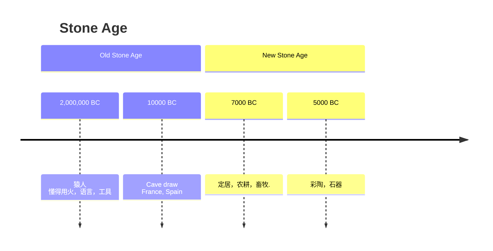
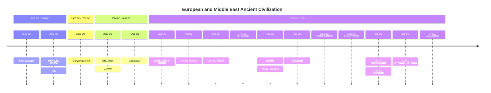
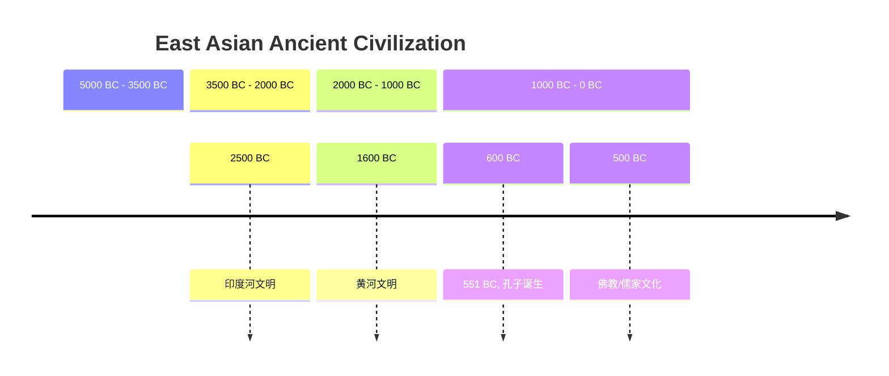
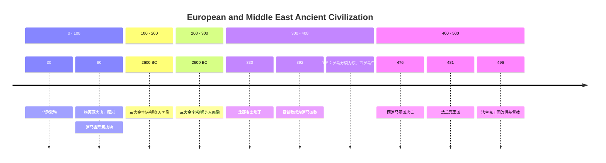
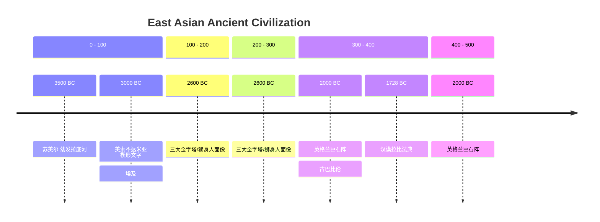
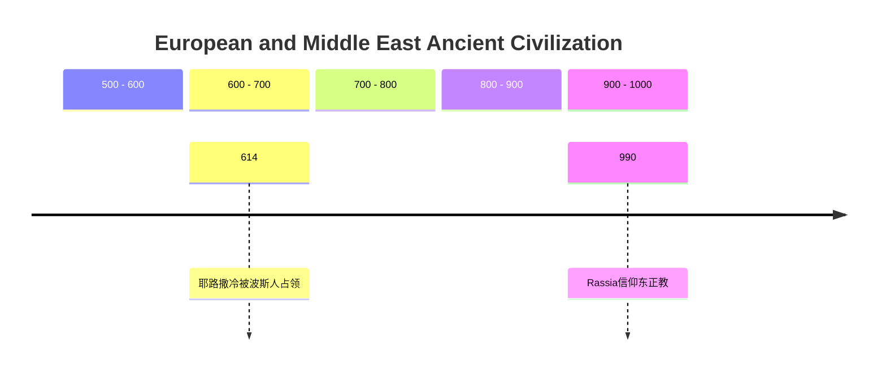
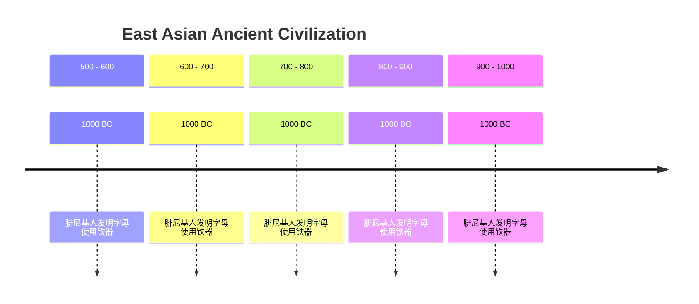

# World_history_time_line

## Stone Age （Before 5000 BC）

```mermaid
timeline

title Stone Age

section Old Stone Age
    2,000,000 BC: 猿人<br>懂得用火，语言，工具
    10000 BC : Cave draw<br> France, Spain
section New Stone Age
    7000 BC : 定居，农耕，畜牧.

    5000 BC : 彩陶，石器
```

## Ancient Civilization (5000BC ~ 0 BC)

```mermaid
timeline
title European and Middle East Ancient Civilization
section 5000 BC - 3500 BC
    3500 BC : 苏美尔 幼发拉底河
    3000 BC: 美索不达米亚 楔形文字
           : 埃及
Section 3500 BC - 2000 BC
    2600 BC: 三大金字塔/狮身人面像

Section 2000 BC - 1000 BC
    2000 BC: 英格兰巨石阵
           : 古巴比伦
    1728 BC: 汉谟拉比法典
Section 1000 BC - 0 BC
    1000 BC: 腓尼基人发明字母<br>使用铁器
    900 BC: Greece Spardak
    800 BC: Odessa，伊利亚特
          ：776 BC， 第一届奥运会
    500 BC: 波希战争
          : 490 BC, Marathon
    400 BC: 苏格拉底逝世
          ：386 BC, 柏拉图建立雅典学院
          ：336 BC, 亚历山大大帝即位
    200 BC: 190 BC, 有翼的自由女神像
          : 140 BC, 米罗的维纳斯
    100 BC: 31 BC, 罗马战胜埃及，统一地中海
            27 BC, August任皇帝
```

```mermaid
timeline
title East Asian Ancient Civilization
section 5000 BC - 3500 BC

Section 3500 BC - 2000 BC

    2500 BC: 印度河文明
Section 2000 BC - 1000 BC

    1600 BC: 黄河文明
Section 1000 BC - 0 BC
    600 BC: 551 BC, 孔子诞生
    500 BC: 佛教/儒家文化
```

## AD (0 ~ 1000 AD)

```mermaid
timeline
title European and Middle East Ancient Civilization
section 0 - 100
    30 : 耶稣受难
    80 : 维苏威火山，庞贝
       : 罗马圆形竞技场

Section 100 - 200
    2600 BC: 三大金字塔/狮身人面像
Section 200 - 300
    2600 BC: 三大金字塔/狮身人面像
Section 300 - 400
    330: 迁都君士坦丁
    392: 基督教成为罗马国教
    395：罗马分裂为东、西罗马帝国
Section 400 - 500
    476: 西罗马帝国灭亡
    481: 法兰克王国
    496: 法兰克王国改信基督教

```

```mermaid
timeline
title East Asian Ancient Civilization
section 0 - 100
    3500 BC : 苏美尔 幼发拉底河
    3000 BC: 美索不达米亚 楔形文字
           : 埃及
Section 100 - 200
    2600 BC: 三大金字塔/狮身人面像
Section 200 - 300
    2600 BC: 三大金字塔/狮身人面像
Section 300 - 400
    2000 BC: 英格兰巨石阵
           : 古巴比伦
    1728 BC: 汉谟拉比法典
Section 400 - 500
    2000 BC: 英格兰巨石阵

```

## Mid-Age (500 - 1600)

```mermaid
timeline 
title European and Middle East Ancient Civilization
Section 500 - 600
    
Section 600 - 700
    614: 耶路撒冷被波斯人占领
Section 700 - 800
    
Section 800 - 900

Section 900 - 1000
    990: Rassia信仰东正教

```

```mermaid
timeline
title East Asian Ancient Civilization

Section 500 - 600
    1000 BC: 腓尼基人发明字母<br>使用铁器
Section 600 - 700
    1000 BC: 腓尼基人发明字母<br>使用铁器
Section 700 - 800
    1000 BC: 腓尼基人发明字母<br>使用铁器
Section 800 - 900
    1000 BC: 腓尼基人发明字母<br>使用铁器
Section 900 - 1000
    1000 BC: 腓尼基人发明字母<br>使用铁器
```