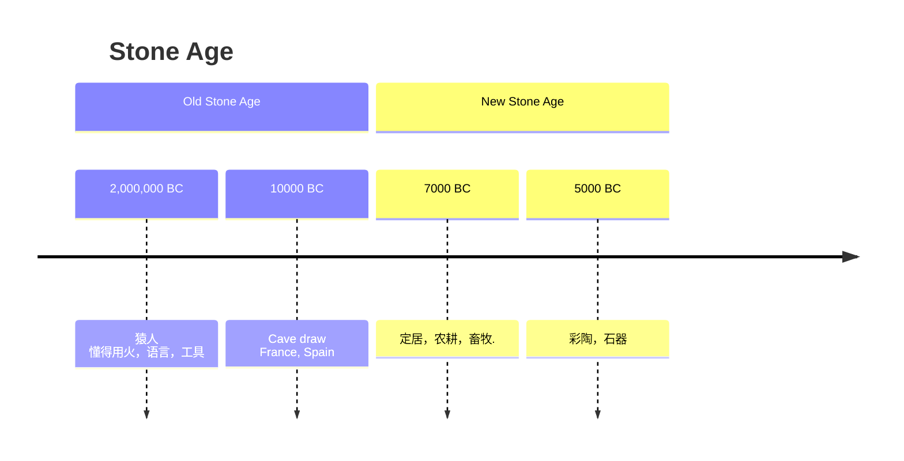
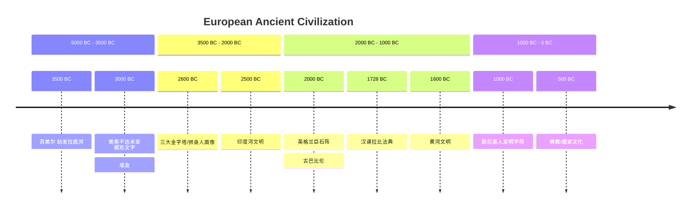
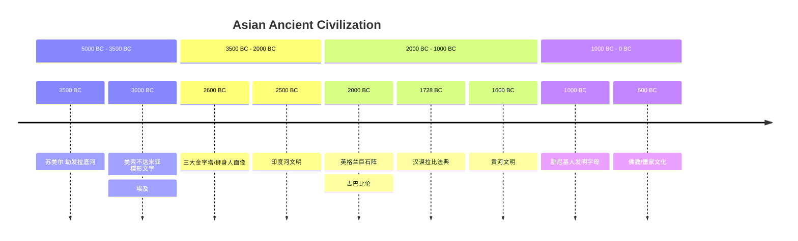

# World_history_time_line

## Stone Age

```mermaid
timeline

title Stone Age

section Old Stone Age
    2,000,000 BC: 猿人<br>懂得用火，语言，工具
    10000 BC : Cave draw<br> France, Spain
section New Stone Age
    7000 BC : 定居，农耕，畜牧.

    5000 BC : 彩陶，石器
```

## Ancient Civilization

```mermaid
timeline
title European Ancient Civilization
section 5000 BC - 3500 BC
    3500 BC : 苏美尔 幼发拉底河
    3000 BC: 美索不达米亚 楔形文字
           : 埃及
Section 3500 BC - 2000 BC
    2600 BC: 三大金字塔/狮身人面像
    2500 BC: 印度河文明
Section 2000 BC - 1000 BC
    2000 BC: 英格兰巨石阵
           : 古巴比伦
    1728 BC: 汉谟拉比法典
    1600 BC: 黄河文明
Section 1000 BC - 0 BC
    1000 BC: 腓尼基人发明字母
    500  BC: 佛教/儒家文化
```

```mermaid
timeline
title Asian Ancient Civilization
section 5000 BC - 3500 BC
    3500 BC : 苏美尔 幼发拉底河
    3000 BC: 美索不达米亚 楔形文字
           : 埃及
Section 3500 BC - 2000 BC
    2600 BC: 三大金字塔/狮身人面像
    2500 BC: 印度河文明
Section 2000 BC - 1000 BC
    2000 BC: 英格兰巨石阵
           : 古巴比伦
    1728 BC: 汉谟拉比法典
    1600 BC: 黄河文明
Section 1000 BC - 0 BC
    1000 BC: 腓尼基人发明字母
    500  BC: 佛教/儒家文化
```
